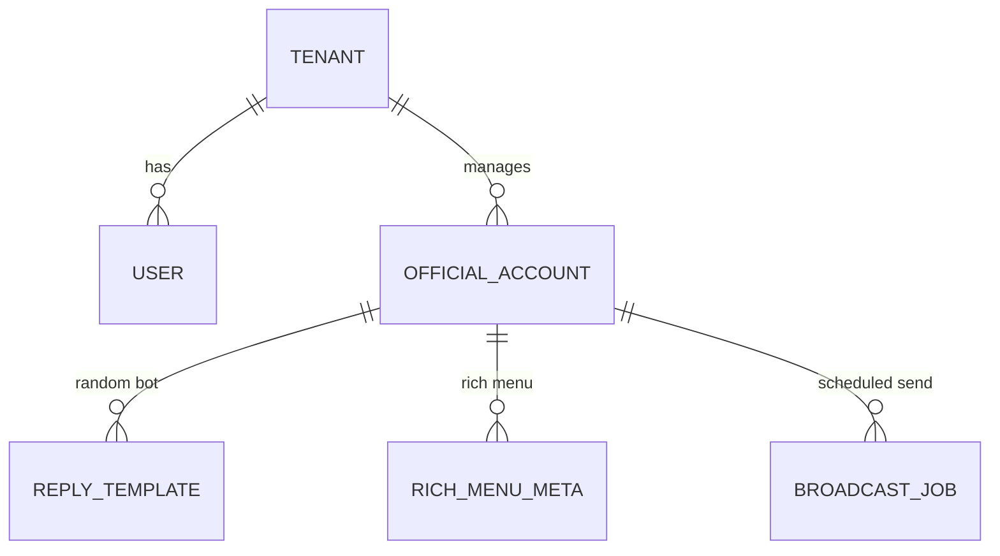

# VT‑LineAds SaaS — **Phase 1 要件定義 v1.0**

> **フェーズ1 = 早期リリース対象**\
> **必須機能のみを絞り込み**、2〜3 週間で公開できるスコープに縮小しました。

| フェーズ              | 期間目安                    | 目的                                                                               |
| ----------------- | ----------------------- | -------------------------------------------------------------------------------- |
| **Phase 1 (MVP)** | 2025‑06‑17 → 2025‑07‑05 | リッチメニュー / 返信ボット / 週1予定表配信 / **PostgreSQL & GraphQL 基盤導入** を提供し、最初のユーザー（あなた）で実戦投入 |
| Phase 2           | 未定                      | 残量通知 / 日次レポート / 当日リマインド Bot＋リッチメニュー / セグメント配信 / **LINE Login＋LIFF 管理画面** / UI 改善 |
| Phase 3           | 未定                      | クリックタグ自動付与 / A/B テスト & CTR最適化 / 頻度キャップ / 未読ユーザー検出 / 費用ダッシュボード拡張                  |
| **Phase X (検討中)** | 未定                      | マルチテナント / Stripe 課金 / Ads API (要検討)                                              |

---

## 1. フェーズ1 機能一覧

| # | カテゴリ        | 機能                                      | 備考                              |
| - | ----------- | --------------------------------------- | ------------------------------- |
| 1 | **リッチメニュー** | ① 作成 ② 更新 ③ 画像直アップロード ④ デフォルト設定切替       | Messaging API `/richmenu` 系のみ使用 |
| 2 | **返信ボット**   | ランダム返信テンプレート CRUD + ウェブフック受信 & 重み付き抽選返信 | テンプレ 0 件時は無応答ログのみ               |
| 3 | **週1予定表配信** | ブロードキャスト／マルチキャスト送信 & 予約                 | 画像 + テキスト対応、スケジュール UI 必須        |

> **除外:** メッセージ残量通知・日次レポート・Stripe・Ads API などは Phase 2 以降

---

## 2. ユーザーストーリー (Phase 1)

| ID           | ストーリー                                        | 完了条件                               |
| ------------ | -------------------------------------------- | ---------------------------------- |
| **P1‑US‑01** | Vtuberとして、毎週月曜に今週の配信予定表画像をファンへ送信したい          | 予約設定 → 指定時刻にブロードキャスト実行 & 成功レスポンス確認 |
| **P1‑US‑02** | Vtuberとして、ファンが任意のテキストを送ったら楽しいランダム返信を返したい     | テンプレを 3 件以上登録し、送信たびに確率で異なる返信が返る    |
| **P1‑US‑03** | Vtuberとして、配信内容に合わせたリッチメニューを画像アップロードだけで差し替えたい | 画像ドラッグ → プレビュー → 「公開」で即座に OA に反映   |

---

## 3. アーキテクチャ（Phase 1 簡易版）

```
[React SPA (Vite build)] → Nginx (or Caddy) on single VPS (例: Lightsail t4g.micro) (静的配信) 
                                │
Go 1.23 API service (systemd) 
                                │
[SQLite]  ── reply_template, rich_menu_meta, schedule_job
```

- CI/CD = GitHub Actions → SSH/rsync deploy (systemd restart)
- 認証 = Google OAuth (直接実装、Cognito なし)

---

## 技術スタック概要（用途・メリット・デメリット）

| レイヤ / コンポーネント                    | 用途                             | メリット (Why)                        | デメリット / 注意点                    |
| -------------------------------- | ------------------------------ | --------------------------------- | ------------------------------ |
| **React 18 + Vite**              | フロントエンド SPA & LIFF             | 超高速HMR・TSネイティブ・豊富なエコシステム          | SSRが必要ならNext.js検討 / JSX習得必須    |
| Tailwind CSS + shadcn-ui         | UIスタイリング & コンポーネント             | クラスユーティリティで一貫テーマ・ダークネオン実装が楽       | HTMLクラスが長くなりがち。学習コスト少しあり       |
| Go 1.23 + Fiber                  | REST / GraphQL / gRPC API      | 高性能、単一バイナリ、ミドルウェア豊富、静的型           | Echo/Ginより新しめ→参考記事がやや少ない       |
| Ent ORM                          | DB モデル定義 & マイグレーション            | 型安全クエリ・GraphQL 値オブジェクト自動生成        | スキーマDSL 学習が必要。複雑JOIN記述が冗長      |
| PostgreSQL 16                    | メイン永続DB                        | SQL標準・ウィンドウ関数・JSONB・拡張が豊富         | フルマネージド(Aurora)以外ではチューニング必要    |
| Redis + asynq                    | ジョブキュー (分割送信/ETL)              | シンプル・遅延ジョブ・リトライ/DeadLetter機能      | Redisプロセス管理(メモリ)が必要 / 有効期限管理必須 |
| S3 + CloudFront                  | 静的配信 (画像・React build) + バックアップ | グローバル高速・安価・バージョニング                | パーミッション設定を誤ると公開漏えいリスク          |
| AWS Lambda + API Gateway         | Phase1/2 サーバレスAPI              | 自動スケール・運用0・従量課金                   | コールドスタート、実行5〜15分制限             |
| EKS (t4g.small×3)                | Phase3 Mini‑K8s 可観測性強化         | ServiceMesh, GitOps, 全Podメトリクス    | 運用工数↑、月コスト約¥38k〜               |
| Prometheus + Grafana/Loki/Tempo  | メトリック / ログ / トレース可視化           | 完全OSS・一元ダッシュボード・Alertmanager連携    | 初期セットアップ複雑。ストレージ拡張にS3必要        |
| Caddy 2                          | 逆プロキシ & 自動TLS                  | 設定1ファイル・HTTP/3・Let'sEncrypt自動     | 機能拡張がNginxより少ない。arm64ビルド注意     |
| GitHub Actions                   | CI/CD (ビルド・テスト・デプロイ)           | GitHub一体・Marketplace豊富・Secret管理簡単 | Self‑host runnerが必要なら追加運用      |
| OpenAI GPT‑4o / DALL·E / Whisper | AI 翻訳・提案・画像生成・切り抜き             | 高精度・インフラ不要・従量×数百円                 | APIレート制限・トークン課金、機密データ送信注意      |
| Redis Token Bucket               | AI API用レート制限                   | O(1)実装、Lua不要                      | Redis依存。多クラスタ時に同期必要            |

> この表を参照いただければ「どの技術が何のために入っていて、得／損は何か」が一目で把握できます。

| レイヤ                | 採用技術 / ツール                                  | バージョン・補足                                                             |
| ------------------ | ------------------------------------------- | -------------------------------------------------------------------- |
| **フロントエンド**        | React 18.x + Vite 5 + TypeScript 5          | 超高速 HMR (SWC) / ファイル単位コードスプリット                                       |
|                    | TanStack Query 5 / Zustand 4 / shadcn-ui    | データフェッチ & キャッシュ / 軽量状態管理 / Radix ベース UI コンポーネント                      |
|                    | Tailwind CSS 3 + PostCSS + autoprefixer     | `@apply` & CSS 変数でテーマ切替                                              |
| **テスト**            | Vitest + React Testing Library / Playwright | ヘッドレス E2E も GitHub Actions で実行                                       |
| **バックエンド**         | Go 1.23 + Fiber v3 + Ent ORM                | Fiber: 高速 HTTP + ミドルウェア豊富 / Ent で型安全クエリ生成                            |
|                    | slog (zap adapter) + OpenTelemetry          | JSON structured logs → Grafana/Loki, trace export                    |
| **DB**             | PostgreSQL 16                               | Schema 管理: Atlas → `atlas migrate` CI 連携                             |
| **API**            | GraphQL (Apollo Server) / gRPC (internal)   | 同一リポジトリでフル型安全 呼び出し                                                   |
| **認証**             | Google OAuth (OIDC) + Paseto v4 cookie      | Cognito 不使用／OIDC 直接実装                                                |
| **リバースプロキシ / TLS** | Caddy 2.8                                   | 自動 TLS + HTTP/3 QUIC 有効化                                             |
| **DevOps / CI**    | GitHub Actions → rsync SSH deploy           | Taskfile / GoReleaser / Renovate で依存更新自動 PR                          |
| **観測**             | Prometheus + Grafana Agent / Loki / Sentry  | 無料枠 Grafana Cloud へ remote\_write                                    |
| **インフラ (Phase 1)** | 単一 ARM VPS (Lightsail t4g.micro)            | systemd サービス: `frontend.service`, `backend.service` / Docker はローカル専用 |

---

## UI/UX デザイン指針

- **トーン & モード**: "漆黒 (Near‑Black)" をベースに、アクセントとして #00E0FF 系シアンを少量利用。  - 背景: `#0B0B0E` 〜 `#111216` のグラデーション  - カード / パネル: `#1A1C20` に内側シャドウで層を演出  - テキスト: `#E5E5E5` (主要) / `#9FA3A9` (セカンダリ) でコントラスト AA 準拠
- **レスポンシブ設計**: Tailwind の `sm / md / lg / xl` ブレークポイントで **PC・タブレット・モバイル** すべて最適化。コンポーネントは Auto Layout (Flex/Grid) 前提で列数変更。
- **タイポグラフィ**: Inter / Noto Sans JP、見出しは `font-semibold`, 本文は `font-normal`。行高 1.5 で可読性確保。
- **コンポーネントスタイル**:
  - ボタン: 角丸 `rounded-2xl`, 高さ `h-10`, アイコン+ラベルの並び。ホバーカラーはシアン透明度 10%。
  - カード: `border border-zinc-800` + `shadow-inner`。上部に 1px ラインで区切り。
  - テーブル: ゼブラストライプ (`bg-zinc-900/40`) + `hover:bg-zinc-800/60`。
- **ダークモード基準**: *Dark first* 設計。ライトテーマは未対応で OK。
- **アニメーション**: framer‑motion で `opacity / translateY` 0.3s イーズアウト。大きな動きは避け、目に優しい。
- **アクセシビリティ**: コントラスト比 4.5:1 を満たす。Tab 焦点リングは `outline-cyan-400`。

## 4. ER 図 (Phase 1 最小)



| テーブル               | PK         | 主な属性                                      |
| ------------------ | ---------- | ----------------------------------------- |
| `tenant`           | tenant\_id | name                                      |
| `user`             | user\_id   | email, role, tenant\_id                   |
| `official_account` | oa\_id     | channel\_id, access\_token, tenant\_id    |
| `reply_template`   | reply\_id  | oa\_id, text, weight INT, is\_active      |
| `rich_menu_meta`   | rm\_id     | oa\_id, name, areas\_json, is\_default    |
| `broadcast_job`    | job\_id    | oa\_id, body\_json, scheduled\_at, status |

---

## 5. API (Phase 1)

### 5.1 リッチメニュー

| Method | Path                         | 説明                |
| ------ | ---------------------------- | ----------------- |
| POST   | `/richmenus`                 | メタ作成 (name, size) |
| PUT    | `/richmenus/{rm_id}`         | エリア更新             |
| POST   | `/richmenus/{rm_id}/content` | 画像直アップロード         |
| POST   | `/richmenus/{rm_id}/link`    | デフォルト設定/解除        |

### 5.2 返信ボット

| Method    | Path                | 説明                 |
| --------- | ------------------- | ------------------ |
| GET       | `/bot/replies`      | 一覧                 |
| POST      | `/bot/replies`      | 追加                 |
| PUT       | `/bot/replies/{id}` | 編集                 |
| DELETE    | `/bot/replies/{id}` | 削除                 |
| (Webhook) | `/webhook/line`     | LINE → Lambda (Go) |

### 5.3 週1予定表配信

| Method | Path                  | 説明                         |
| ------ | --------------------- | -------------------------- |
| POST   | `/messages/broadcast` | 即時送信 or 予約 (scheduled\_at) |
| GET    | `/messages/jobs`      | 予約一覧                       |

---

## 6. リリース計画 (例)

| 週  | タスク                      | 成果物                                     |
| -- | ------------------------ | --------------------------------------- |
| W1 | プロジェクト初期設定 / ERD 実装 / 認証 | VPS 初期セットアップ / Google OAuth + 基本 API 動作 |
| W2 | リッチメニュー CRUD + 画像転送      | メニュー作成 → OA に反映確認                       |
| W2 | Reply Bot CRUD + Webhook | ランダム返信テスト OK                            |
| W3 | ブロードキャスト送信 & 予約          | 30 分前告知フロー動作                            |
| W3 | Sentry & デプロイ自動化         | テスト完了 → **リリース**                        |

---

## 7. 今後のフェーズ概要

- **Phase 2**: 残量通知 / 日次レポート / 当日リマインド Bot＋リッチメニュー / セグメント配信 / **LINE Login＋LIFF 管理画面** / UI polish
- **Phase 3**: クリックタグ自動付与 / A/B テスト & CTR最適化 / 頻度キャップ / 未読ユーザー抑制 / 費用ダッシュボード拡張
- **Phase X (検討中)**: マルチテナント / Stripe 課金 / Ads API

---

> **フィードバック歓迎**\
> スコープやスケジュール感が合っているかご確認ください。調整があればお知らせください。

---

### フェーズ一覧（優先度付き）

| フェーズ              | 目的 & ゴール                                                                                                                      | 含める機能候補                                                                 | 優先度 (H/M/L)       | 理由・備考                  |
| ----------------- | ----------------------------------------------------------------------------------------------------------------------------- | ----------------------------------------------------------------------- | ----------------- | ---------------------- |
| **Phase 1 (MVP)** | 週1予定表画像配信 / リッチメニュー CRUD / ランダムBot / PostgreSQL+GraphQL / **YouTube連携 (Google OAuth・****任意のライトフロー****)＋Verifiedバッジ＋お礼画像自動送信** | 〜2025-07-05                                                             |                   |                        |
| **Phase 2**       | 運用コスト最適化 & ミス防止                                                                                                               | セグメント配信 / 当日リマインド Bot+リッチメニュー / メッセージ残量通知 / 日次レポート / UI 改善              | H / H / M / M / L | 通数削減と運用リスク低減を最優先       |
| **Phase 3**       | 効果最大化・詳細最適化                                                                                                                   | クリックタグ計測 / A/B テスト & CTR 最適化 / 頻度キャップ / 未読ユーザー検出 / 費用ダッシュボード拡張          | H / H / M / M / L | ROI 改善フェーズ。計測→改善ループを回す |
| **Phase X (検討中)** | Low                                                                                                                           | マルチテナント / Stripe課金 / Ads API / **AI Bot自動生成** / **運用添削AI (ダッシュボードコーチ)** |                   |                        |

## 24h ルール運用ポリシー

> **Messaging API 無料枠適用条件 (公式ドキュメント 2025‑05)**
>
> 1. `replyMessage` は **ユーザー発メッセージ／postback／QRコードスキャン** など "アクティブイベント" 起点に限り無料。
> 2. 同ユーザーに対し **最初のイベント発生から 24 時間以内** に返信したものまでが対象。
> 3. 24 h ウィンドウ中は複数回 `replyMessage` しても課金ゼロ。
> 4. `pushMessage` / `multicast` / `broadcast` は常に課金対象。
>
> **アプリ実装ポリシー**
>
> - Webhook 受信時に `event.timestamp` と DB の `last_active_at` を比較し、24 h 超過なら Bot 返信を中止 or Queue に回す。
> - リッチメニュー `postback` も同じロジックで検証。
> - 管理画面で 24 h ウィンドウ残り時間をバッジ表示（"残り 3 h"）。
> - “超過したら自動 Push 切替” は **コスト爆弾** になるため禁止。

---

## PostgreSQL バックアップ / リストア手順 (VPS)

> **前提**: Debian/Ubuntu, データディレクトリ `/var/lib/postgresql/16/main`, バックアップ S3 バケット `s3://vt-lineads-backup`

### 1. pg\_dump (日次 SQL スナップショット)

```bash
export DATE=$(date +%F)
sudo -u postgres pg_dump -Fc vtlineads > /tmp/pg_${DATE}.dump
aws s3 cp /tmp/pg_${DATE}.dump s3://vt-lineads-backup/sql/
rm /tmp/pg_${DATE}.dump
```

- GitHub Actions の cron (`schedule: cron(\"0 0 * * *\")`) で実行。
- サイズ 100 MB/日 ≒ 3 GB/月。

### 2. pgBackRest (WAL 連続)

```bash
# once
sudo apt-get install pgbackrest
sudo -u postgres pgbackrest stanza-create --stanza=vtlineads
```

- `pgbackrest.conf` に S3 リポジトリ設定。
- WAL 差分バックアップ → S3 Standard-IA 約 5 GB/月。

### 3. リストア手順

```bash
sudo systemctl stop postgresql
sudo -u postgres pgbackrest restore --stanza=vtlineads --delta
sudo systemctl start postgresql
```

- pg\_dump から戻す場合：`pg_restore -d vtlineads pg_xx.dump`。

---

---

### フェーズ一覧（再整理）

| フェーズ                          | 目的 & キーワード   | 主要機能                                                                                                   | 予定時期        |
| ----------------------------- | ------------ | ------------------------------------------------------------------------------------------------------ | ----------- |
| **Phase 1 (MVP)**             | まず運用開始       | 週1予定表画像配信 / リッチメニュー CRUD / ランダムBot / PostgreSQL+GraphQL                                                | 〜2025‑07‑05 |
| **Phase 2 – コスト最適化 & モバイルUX** | “節約・どこでも操作”  | セグメント配信 / LINE Login＋LIFF管理 / YouTube自動予定表生成 / Neon Glow UI＋ヒートメータ / 残量通知 / 日次レポート                     | 2025 Q3     |
| **Phase 3 – 効果最大化 & 高度分析**    | “データで伸ばす”    | クリックタグ計測 / A‑Bテスト & CTR最適化 / 頻度キャップ / 未読ユーザー検出 / 費用ダッシュボード拡張 / 画像自動リサイズ＋文言合成（AI）                       | 2025 Q4     |
| **Phase 4 – AIプレミアム & 拡張**    | “クリエイター支援AI” | AIトーン翻訳 / 次の一手レコメンド / AIハイライト切り抜き / 感情クラスタリングタグ付与 / ファンバッジ / OBS・StreamDeck連動 / 多チャネル抽象化 / Stripe多通貨対応 | 2026〜       |
| **Phase X (検討中)**             | 事業スケール       | マルチテナント / SaaS課金モデル最適化 / Ads API                                                                       | TBD         |

---

\------|-----------|--------|------| | **Phase 1 (MVP)** | 週1予定表画像配信 / リッチメニュー CRUD / ランダム返信Bot / PostgreSQL + GraphQL基盤 | 実装中 | 2025-07-05 リリース目標 | | **Phase 2** | セグメント配信 / LINE Login＋LIFF 管理画面 / **YouTube API 週間予定自動生成** / Neon Glow UI＋ヒートメータ / 残量通知 / 日次レポート | High | コスト最適化とモバイル運用 UX 強化 | | **Phase 3** | クリックタグ計測 / A/B テスト・CTR最適化 / **AI ジェネレーティブ告知** / OBS・Stream Deck 連動 / ファンランク＆バッジ / 頻度キャップ / 未読ユーザー検出 / 費用ダッシュボード拡張 | Medium | 効果最大化・コミュニティ活性化 | | **Phase X (検討中)** | マルチテナント / Stripe課金 / Ads API | Low | 事業化ステージで検討 |

---

## AI Premium 機能プラン (Phase X)

| コード | AI 機能                        | 価値           | 推定コスト/月/チャンネル |
| --- | ---------------------------- | ------------ | ------------- |
| A   | トーン調整 & 翻訳 (敬語↔フランク / JP↔EN) | 多言語・企業コラボ対応  | ≈ ¥200        |
| B   | 次の一手レコメンド (ダッシュボードコーチ)       | KPI→行動提案     | ≈ ¥150        |
| C   | 画像自動リサイズ＋文言合成                | 告知クリエイティブ即生成 | ≈ ¥120        |
| D   | 感情クラスタリングタグ付与                | セグメント精緻化     | ≈ ¥500        |
| E   | AI ハイライト切り抜き (30-60 秒)       | アーカイブ追体験     | ≈ ¥400        |

> **Premium コース** = A+B+C / **Add‑ons** = D (+¥500), E (+¥400)

---

## 市場規模 & 収益シミュレーション

### 国内（3 年目想定）

| プラン              | 利用チャンネル       | 月額                | 月MRR                                 | 年MRR |
| ---------------- | ------------- | ----------------- | ------------------------------------ | ---- |
| プラン              | 月額 (税込)       | 無料メッセージ枠          | 含まれる主な機能                             |      |
| -------          | ------------: | ----------------: | -----------------                    |      |
| **Hobby (FREE)** | **0 円**       | 1,000 通           | 週1予定表 / リッチメニュー / Bot 20 テンプレ        |      |
| **Creator**      | **980 円**     | 5,000 通           | + セグメント（アクティブ7日） / 画像リサイズ            |      |
| **Pro**          | **4,980 円**   | 30,000 通          | + 自動予定表生成 / LINE Login+LIFF / ヒートメータ |      |
| **Premium**      | **9,800 円**   | 100,000 通         | + AI 翻訳 & レコメンド / A-B テスト / 頻度キャップ   |      |

### グローバル拡張後

- 追加潜在ユーザー ≈ **675 チャンネル**
- 合計 1,075 チャンネル → **年間売上 ≈ ¥112 M**（国内 2.7 倍）

---

## グローバル対応で要件見直しポイント

1. **i18n / l10n**
   - React Intl + `next-intl` に切替、UI テキストを JSON 辞書化
   - 初期対応: `ja`, `en`, `es`, `pt-BR`
2. **多チャネル送信**
   - LINE に加え **WhatsApp Business API / Telegram Bot / Discord Webhook** 抽象ラッパーを設計
3. **OAuth 拡充**
   - Google, LINE に加え **Discord Login** を Phase 2.5 で追加
4. **タイムゾーン & カレンダー**
   - 送信予約を `tenant.timezone` で保存、UI は `Intl.DateTimeFormat`
5. **通貨 / 料金プラン i18n**
   - Stripe Multi‑Currency (USD/EUR/JPY)
   - VAT / GST 自動計算
6. **GDPR / データ保護**
   - EU 居住者の `deleteMyData` API
   - Sentry IP 整合マスキング
7. **CDN / 配信**
   - CloudFront + Regional Edge Cache → 海外レイテンシ <150 ms
8. **AI モデル地域 endpoint**
   - OpenAI `api.openai.com`  + Bedrock `us-east-1` デュアル
   - Latency-critical呼び出しは Edge Function cache

> **フェーズ割当案**
>
> - **Phase 2.5**: i18n基盤 + Stripe多通貨 + Discord OAuth
> - **Phase 3**: WhatsApp/TG Adapter + Timezone Scheduler
> - **Phase X**: GDPR API + CDN最適化


## 運用監視インフラ選択肢

| レベル                    | 目的              | コア構成                                                                                 | 概算コスト/月       |
| ---------------------- | --------------- | ------------------------------------------------------------------------------------ | ------------- |
| **Lv‑1 マネージド＋サーバレス**   | 手離れ優先、壊れないこと    | Lambda (Go) + API Gateway / S3+CF / Aurora Serverless v2 / SQS / CloudWatch + Sentry | **約 ¥14,000** |
| **Lv‑2 Mini‑K8s 観測強化** | 可観測性重視、Podレベル制御 | EKS (t4g.small×3) + Linkerd + ArgoCD + Prometheus + Grafana/Loki/Tempo + Thanos      | **約 ¥38,000** |

### Mini‑K8s 導入ステップ（抜粋）

1. `eksctl create cluster --nodes 3 --node-type t4g.small ...`
2. Helm で ArgoCD / Prometheus Stack / Loki / Tempo をデプロイ
3. Alertmanager → LINE Notify (運営アラート)

### スケールロードマップ

| フェーズ      | 推奨構成                                  |
| --------- | ------------------------------------- |
| Phase 1–2 | Lv‑1 (サーバレス)                          |
| Phase 3   | Mini‑EKS + GitOps                     |
| Phase 4   | メッシュ + 長期メトリクス保存 + Tempo 全 Pod トレーシング |


## Pending Feature Ideas (Backlog)

- 推しメーター (視聴時間+スパチャでリアルタイムゲージ / OBS連携)
- 月替りボイスおみくじ (AI生成30秒ボイス)
- スタンプカード & デジタル特典 (サイン色紙/呼び名ボイス)
- ARツーショ自撮りフィルター (WebAR)
- 推しグッズ先行購入シークレットリンク (Shopify/DLsite連携)
- Discord Verifiedロール自動付与 (Discord Bot)

---

