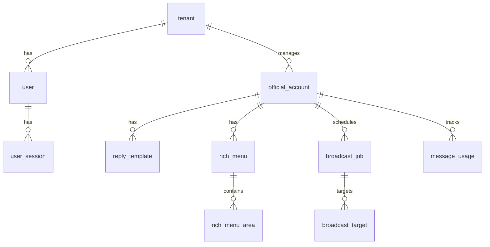
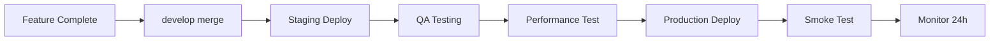

# VT-LineAds SaaS — **要件定義 v2.0（品質重視版）**

> **開発方針：品質とスケーラビリティを重視した堅牢な基盤構築**
> 早期リリースよりも、**型安全性・テスタビリティ・運用性**を優先し、長期的な開発効率を最大化します。

| フェーズ               | 期間目安                | 目的                                                                                         |
| ---------------------- | ----------------------- | -------------------------------------------------------------------------------------------- |
| **Phase 1 (基盤構築)** | 2025-06-17 → 2025-08-10 | PostgreSQL + GraphQL + 完全型安全基盤 / リッチメニュー / 返信ボット / 週 1 予定表配信        |
| **Phase 2**            | 2025 Q3                 | セグメント配信 / LINE Login ＋ LIFF / YouTube 自動連携 / 残量通知 / 日次レポート             |
| **Phase 3**            | 2025 Q4                 | クリックタグ計測 / A/B テスト & CTR 最適化 / AI 告知生成 / 頻度キャップ / 費用ダッシュボード |
| **Phase 4**            | 2026〜                  | AI プレミアム機能 / OBS・StreamDeck 連携 / 多チャネル対応 / グローバル展開                   |

---

## 1. 開発基盤アーキテクチャ

### 1.1 開発環境構成

```yaml
# Docker Compose による完全ローカル環境
services:
  postgres: # PostgreSQL 16（メインDB）
  redis: # Redis 7（ジョブキュー・キャッシュ）
  minio: # MinIO（S3互換ローカルストレージ）
  api: # Go API with Hot Reload (Air)
  frontend: # React with Vite HMR
```

### 1.2 技術スタック詳細

| レイヤ               | 技術スタック                          | 選定理由                                 |
| -------------------- | ------------------------------------- | ---------------------------------------- |
| **フロントエンド**   | React 18 + Vite 5 + TypeScript 5      | 超高速 HMR、完全型安全、最新エコシステム |
| **状態管理**         | TanStack Query v5 + Zustand           | サーバー状態とローカル状態の分離         |
| **UI**               | Tailwind CSS + shadcn-ui              | 一貫性のあるダークネオンテーマ実装       |
| **API**              | Go 1.23 + Fiber v3 + GraphQL (gqlgen) | 高性能、フロントエンドとの完全型共有     |
| **ORM**              | Ent + Atlas                           | 型安全クエリ、自動マイグレーション       |
| **DB**               | PostgreSQL 16                         | JSONB、Window 関数、高い拡張性           |
| **キャッシュ/Queue** | Redis 7 + asynq                       | シンプルなジョブ管理、Pub/Sub            |
| **認証**             | Google OAuth + Paseto v4              | Cognito レス、セキュアなトークン管理     |
| **IaC**              | Terraform + AWS                       | 完全な環境再現性                         |
| **CI/CD**            | GitHub Actions + Renovate             | 自動テスト、依存関係自動更新             |
| **監視**             | Prometheus + Grafana + Sentry         | メトリクス・ログ・エラーの統合監視       |

### 1.3 型安全性アーキテクチャ

```
[GraphQL Schema]
    ↓ (gqlgen)
[Go Types & Resolvers]
    ↓ (GraphQL Codegen)
[TypeScript Types & Hooks]
    ↓
[Type-safe API Calls]
```

**Makefile による統一コマンド**：

- `make dev` - 開発環境起動
- `make gen` - 全型生成（Ent + GraphQL）
- `make test` - 全テスト実行
- `make migrate-up` - DB マイグレーション

---

## 2. Phase 1 機能詳細

### 2.1 機能一覧

| #   | カテゴリ            | 機能                                          | 技術仕様                                       |
| --- | ------------------- | --------------------------------------------- | ---------------------------------------------- |
| 1   | **リッチメニュー**  | CRUD + 画像アップロード + デフォルト切替      | GraphQL Mutation、画像は 10MB 上限（JPEG/PNG） |
| 2   | **返信ボット**      | テンプレート CRUD + 重み付き抽選 + レート制限 | 1 ユーザー 10 回/分制限、Redis Token Bucket    |
| 3   | **週 1 予定表配信** | ブロードキャスト予約 + 画像添付               | asynq によるジョブスケジューリング             |
| 4   | **基盤**            | 認証・型生成・監視・CI/CD                     | Google OAuth、GraphQL Codegen、Prometheus      |

### 2.2 非機能要件

| 項目               | 要件                    | 実装方法                                |
| ------------------ | ----------------------- | --------------------------------------- |
| **パフォーマンス** | API 応答 < 200ms (p95)  | Fiber 高速ルーティング、DB 接続プール   |
| **可用性**         | 99.9%（月間 43 分以内） | ヘルスチェック、自動再起動              |
| **セキュリティ**   | OWASP Top 10 対応       | CSRF トークン、SQL インジェクション対策 |
| **テスト**         | カバレッジ 80%以上      | 単体・統合・E2E テスト自動化            |
| **監視**           | 3 分以内にアラート      | Prometheus + AlertManager               |

---

## 3. データベース設計（Phase 1）

### 3.1 ER 図



### 3.2 主要テーブル定義

| テーブル           | 主要カラム                                   | インデックス                  | 備考               |
| ------------------ | -------------------------------------------- | ----------------------------- | ------------------ |
| `tenant`           | id, name, plan, created_at                   | plan, created_at              | マルチテナント基盤 |
| `user`             | id, email, tenant_id, role                   | email(unique), tenant_id      | Google OAuth 連携  |
| `official_account` | id, tenant_id, channel_id, access_token      | tenant_id, channel_id(unique) | LINE Channel       |
| `reply_template`   | id, oa_id, text, weight, is_active           | oa_id + is_active             | 重み付き抽選用     |
| `rich_menu`        | id, oa_id, name, size, image_url, is_default | oa_id + is_default            | 複数メニュー管理   |
| `broadcast_job`    | id, oa_id, scheduled_at, status, payload     | oa_id + scheduled_at + status | ジョブキュー連携   |

---

## 4. API 設計（GraphQL）

### 4.1 スキーマ例

```graphql
type Query {
  # リッチメニュー
  richMenus(oaId: ID!): [RichMenu!]!
  richMenu(id: ID!): RichMenu

  # 返信テンプレート
  replyTemplates(oaId: ID!, active: Boolean): [ReplyTemplate!]!

  # 配信ジョブ
  broadcastJobs(oaId: ID!, status: JobStatus): [BroadcastJob!]!
}

type Mutation {
  # リッチメニュー
  createRichMenu(input: CreateRichMenuInput!): RichMenu!
  updateRichMenu(id: ID!, input: UpdateRichMenuInput!): RichMenu!
  uploadRichMenuImage(id: ID!, file: Upload!): RichMenu!
  setDefaultRichMenu(id: ID!): RichMenu!

  # 返信テンプレート
  createReplyTemplate(input: CreateReplyTemplateInput!): ReplyTemplate!
  updateReplyTemplate(id: ID!, input: UpdateReplyTemplateInput!): ReplyTemplate!
  deleteReplyTemplate(id: ID!): Boolean!

  # ブロードキャスト
  createBroadcastJob(input: CreateBroadcastJobInput!): BroadcastJob!
  cancelBroadcastJob(id: ID!): BroadcastJob!
}

type Subscription {
  broadcastJobUpdated(oaId: ID!): BroadcastJob!
}
```

### 4.2 エラーハンドリング

```graphql
interface Error {
  code: ErrorCode!
  message: String!
}

enum ErrorCode {
  UNAUTHORIZED
  FORBIDDEN
  NOT_FOUND
  VALIDATION_ERROR
  RATE_LIMIT_EXCEEDED
  INTERNAL_ERROR
}
```

---

## 5. インフラ構成

### 5.1 AWS 構成（Terraform 管理）

```hcl
# 本番環境（Phase 1）
resource "aws_lightsail_instance" "app" {
  name              = "vt-lineads-app"
  availability_zone = "ap-northeast-1a"
  instance_plan     = "nano_2_0"  # 2GB RAM, 1 vCPU

  # Caddy + Go API + Static Files
}

resource "aws_db_instance" "postgres" {
  identifier     = "vt-lineads-db"
  engine         = "postgres"
  engine_version = "16.3"
  instance_class = "db.t4g.micro"

  # 自動バックアップ有効
  backup_retention_period = 7
  backup_window          = "03:00-04:00"
}

resource "aws_s3_bucket" "media" {
  bucket = "vt-lineads-media"

  # バージョニング有効
  versioning_configuration {
    status = "Enabled"
  }
}
```

### 5.2 監視・アラート設定

| 監視項目     | 閾値          | アクション         |
| ------------ | ------------- | ------------------ |
| CPU 使用率   | > 80% (5 分)  | スケールアップ検討 |
| メモリ使用率 | > 90%         | アプリ再起動       |
| DB 接続数    | > 80          | 接続プール見直し   |
| エラーレート | > 1%          | Sentry 通知        |
| API 応答時間 | > 500ms (p95) | パフォーマンス調査 |

---

## 6. 開発プロセス

### 6.1 ブランチ戦略

```
main
├── develop
│   ├── feature/rich-menu-crud
│   ├── feature/reply-bot
│   └── feature/broadcast-scheduler
└── hotfix/xxx
```

### 6.2 PR・レビュープロセス

1. **feature → develop**:

   - 自動テスト必須（カバレッジ 80%以上）
   - GraphQL スキーマ変更は型生成確認
   - 最低 1 名の Approve 必要

2. **develop → main**:
   - ステージング環境での QA 完了
   - パフォーマンステスト合格
   - 2 名以上の Approve 必要

### 6.3 リリースフロー



---

## 7. セキュリティ要件

### 7.1 認証・認可

- **認証**: Google OAuth 2.0 (OIDC)
- **セッション**: Paseto v4 トークン（HttpOnly Cookie）
- **認可**: ロールベース（Admin/Member/Viewer）
- **API 保護**: Rate Limiting（Token Bucket）

### 7.2 データ保護

- **通信**: 全通信 HTTPS（Caddy 自動証明書）
- **DB**: 保存時暗号化（AWS 管理）
- **バックアップ**: S3 暗号化保存
- **秘密情報**: AWS Secrets Manager

---

## 8. テスト戦略

### 8.1 テストピラミッド

```
         E2E Tests (10%)
        /----------\
       /Integration \
      /   Tests     \
     /    (30%)      \
    /----------------\
   /   Unit Tests     \
  /      (60%)         \
 /----------------------\
```

### 8.2 テスト自動化

| テスト種別 | ツール              | 実行タイミング   |
| ---------- | ------------------- | ---------------- |
| 単体テスト | Go testing + Vitest | Push 時          |
| 統合テスト | Go + TestContainers | PR 時            |
| E2E テスト | Playwright          | develop merge 時 |
| 負荷テスト | k6                  | リリース前       |

---

## 9. スケジュール（Phase 1）

| 週   | 期間      | タスク                 | 成果物                   |
| ---- | --------- | ---------------------- | ------------------------ |
| W1-2 | 6/17-6/30 | 開発環境構築・基盤実装 | Docker 環境、CI/CD、認証 |
| W3-4 | 7/1-7/14  | GraphQL API・DB 設計   | 型生成、マイグレーション |
| W5   | 7/15-7/21 | リッチメニュー機能     | CRUD、画像アップロード   |
| W6   | 7/22-7/28 | 返信 Bot 機能          | Webhook、レート制限      |
| W7   | 7/29-8/4  | ブロードキャスト機能   | 予約配信、ジョブ管理     |
| W8   | 8/5-8/10  | テスト・監視・文書化   | 本番環境構築、リリース   |

---

## 10. 今後のフェーズ概要

### Phase 2（2025 Q3）

- **LIFF 管理画面**: モバイル最適化 UI
- **YouTube 連携**: 配信予定自動取得
- **セグメント配信**: アクティブ度別配信
- **運用効率化**: 残量通知、日次レポート

### Phase 3（2025 Q4）

- **効果測定**: クリックタグ、A/B テスト
- **AI 機能**: 告知画像自動生成
- **配信最適化**: 頻度キャップ、CTR 最適化
- **連携強化**: OBS、StreamDeck

### Phase 4（2026〜）

- **AI プレミアム**: トーン変換、感情分析
- **グローバル対応**: 多言語、多通貨
- **マルチチャネル**: WhatsApp、Discord 対応

---

> **次のアクション**
>
> 1. Docker Compose 環境の構築開始
> 2. GraphQL スキーマの詳細設計
> 3. Terraform によるインフラ定義

ご質問やフィードバックがあればお知らせください。
